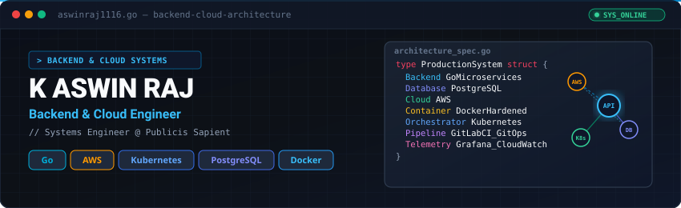

<div align="center">

  <!-- 1. HERO BANNER -->
  

  <br />
  <br />

  <!-- BADGES & COUNTERS -->
  <p>
    <a href="https://github.com/aswinraj1116">
      
    </a>
    <a href="https://github.com/aswinraj1116?tab=repositories">
      
    </a>
    <a href="https://github.com/aswinraj1116">
      
    </a>
  </p>

  <p>
    <b>Engineering production backend systems, scalable cloud infrastructure, and observable services.</b>
  </p>

</div>

---

<!-- 2. SHORT PROFESSIONAL INTRODUCTION -->
## ⚙️ About

I am a **Systems Engineer at Publicis Sapient** specializing in backend systems engineering, cloud infrastructure, and telemetry. My core work revolves around designing reliable microservices, building containerized runtime environments, automating deployment pipelines, and ensuring deep observability across production workloads.

* **Primary Engineering Focus:** Go, PostgreSQL, AWS, Kubernetes, and Docker.
* **Operational Mindset:** Security hardening, automated CI/CD, system maintainability, and architectural performance.

---

<!-- 3. ENGINEERING FOCUS -->
## 🎯 Engineering Focus

<table width="100%">
  <tr>
    <td width="50%" valign="top">
      <h3>⚡ Backend Engineering</h3>
      <ul>
        <li><b>Go</b> &amp; Python runtime microservices</li>
        <li>High-throughput <b>REST APIs</b> &amp; gRPC communication</li>
        <li>Relational Data Modeling with <b>PostgreSQL</b> &amp; MySQL</li>
        <li>Microservice architectures &amp; Modular Monoliths</li>
        <li>Distributed caching with <b>Redis</b></li>
        <li>API performance optimization &amp; contract testing</li>
        <li>System design for failure resilience</li>
      </ul>
    </td>
    <td width="50%" valign="top">
      <h3>☁️ Cloud &amp; Infrastructure</h3>
      <ul>
        <li>Cloud Infrastructure on <b>AWS</b></li>
        <li>Container orchestration using <b>Kubernetes</b></li>
        <li>Containerization with <b>Docker Hardened Images</b></li>
        <li>Infrastructure as Code (IaC) via <b>Terraform</b></li>
        <li>Automated deployment with <b>GitLab CI/CD</b> &amp; GitOps</li>
        <li>Full-stack telemetry using <b>Grafana</b>, <b>CloudWatch</b>, &amp; <b>New Relic</b></li>
        <li>Platform engineering &amp; operational security</li>
      </ul>
    </td>
  </tr>
</table>

---

<!-- 4. TECHNOLOGY STACK -->
## 🛠️ Technology Stack

### Core Technologies
> Primary stack actively used for production services and platform engineering:

<p>
  <a href="https://skillicons.dev">
    
  </a>
</p>

### Complete Tech Inventory

| Category | Technologies |
| :--- | :--- |
| **Languages** | `Go` • `Python` • `TypeScript` |
| **Backend &amp; Databases** | `Go (Standard Library / Gin / Fiber)` • `REST APIs` • `PostgreSQL` • `MySQL` • `Redis` |
| **Cloud &amp; Infrastructure** | `AWS` • `Kubernetes` • `Docker` • `Terraform` • `GitLab CI/CD` • `GitOps` |
| **Observability &amp; Tools** | `Grafana` • `New Relic` • `AWS CloudWatch` • `Prometheus` • `Git` |
| **Secondary Frontend** | `React` • `Flutter` |

---

<!-- 5. FEATURED PROJECTS -->
## 🚀 Featured Projects

### [HeapVue](https://github.com/Heapvue)
> **E-Commerce &amp; Core Backend Systems Architecture**

* **Architecture:** Go-based microservices architecture operating on PostgreSQL, containerized with Docker and instrumented for production telemetry.
* **Key Highlights:**
  * Modular backend design separating transactional domain logic from API delivery layers.
  * Containerized deployment pipelines targeting cloud-native execution.
  * Optimized SQL query execution and transactional isolation with PostgreSQL.
* **Repository:** [github.com/Heapvue](https://github.com/Heapvue)

---

### [SolveMyHealth](https://github.com/SOLVEMyHealth)
> **Healthcare Data Services &amp; API Integration Platform**

* **Architecture:** Backend platform delivering API services, secure data pipelines, and client integrations for healthcare management workflows.
* **Key Highlights:**
  * High-availability REST backend services supporting cross-platform mobile and web applications.
  * Structured database schema design for concurrent user telemetry and health tracking.
  * Reliable data validation and error-budget compliant service interfaces.
* **Repository:** [github.com/SOLVEMyHealth](https://github.com/SOLVEMyHealth)

---

### Production Infrastructure &amp; Security Engineering
> **Container Hardening &amp; CI/CD Pipeline Automation**

* **Architecture:** Enterprise DevOps automation framework emphasizing hardened execution runtime and continuous integration.
* **Key Highlights:**
  * Implementation of **Docker Hardened Images** minimizing vulnerability attack surface in production containers.
  * Declarative **GitLab CI/CD** pipeline configurations for build, static analysis, unit testing, and deployment.
  * Multi-target telemetry integration using **Grafana**, **CloudWatch**, and **New Relic** for real-time error tracking and health metrics.

---

<!-- 6. PROFESSIONAL EXPERIENCE -->
## 🏢 Professional Experience

### **Systems Engineer — Publicis Sapient**
* **Production Container Security:** Engineered and maintained Docker Hardened Images across microservice components to ensure security compliance and vulnerability reduction.
* **CI/CD &amp; Automation:** Maintained GitLab CI/CD pipelines to automate container builds, testing stages, and deployment verification.
* **Database &amp; Services:** Managed PostgreSQL database instances, optimized queries, and integrated backend services.
* **Telemetry &amp; Observability:** Configured metric dashboards and logging pipelines using Grafana, CloudWatch, and New Relic for continuous production monitoring.
* **Infrastructure:** Worked within Kubernetes container runtime environments, supporting service mesh communication and resource allocation.

---

<!-- 7. CURRENT LEARNING -->
## 📈 Engineering Roadmap

```text
[Current Focus Areas]
├── → Go Backend Engineering & Concurrency Models
├── → AWS Cloud Architecture & Infrastructure Design
├── → Kubernetes Container Orchestration & Operators
├── → Distributed Systems & Fault Tolerant Design
├── → Scalable System Design Patterns
└── → Platform Engineering & GitOps Workflows
```

---

<!-- 8. GITHUB STATISTICS -->
## 📊 Statistics

<div align="center">
  <table border="0">
    <tr>
      <td>
        
      </td>
      <td>
        
      </td>
    </tr>
  </table>
  <br />
  
</div>

---

<!-- 9. CONTRIBUTION SNAKE -->
## 🐍 Contribution Activity

<div align="center">
  <picture>
    <source media="(prefers-color-scheme: dark)" srcset="https://raw.githubusercontent.com/aswinraj1116/aswinraj1116/output/github-contribution-grid-snake-dark.svg" />
    <source media="(prefers-color-scheme: light)" srcset="https://raw.githubusercontent.com/aswinraj1116/aswinraj1116/output/github-contribution-grid-snake.svg" />
    
  </picture>
</div>

---

<!-- 10. ACHIEVEMENTS -->
## 🏆 Achievements

<div align="center">
  <p>
    
  </p>
  <p>
    <code>Pull Shark</code> • <code>YOLO</code> • <code>Quickdraw</code>
  </p>
</div>

---

<!-- 11. CONNECT / CONTACT SECTION -->
## 📬 Connect

<div align="center">
  <p>
    <a href="https://www.linkedin.com/in/k-aswin-raj-89374a23b/">
      
    </a>
    &nbsp;
    <a href="https://aswinraj1portfolio.vercel.app">
      
    </a>
    &nbsp;
    <a href="https://github.com/aswinraj1116">
      
    </a>
  </p>
</div>

---

<!-- 12. CLOSING STATEMENT -->
<div align="center">
  <br />
  <pre><code>$ echo "Building resilient systems with Go, Kubernetes, and Cloud Infrastructure."</code></pre>
  <p><i>K ASWIN RAJ — Backend &amp; Cloud Engineer</i></p>
</div>
